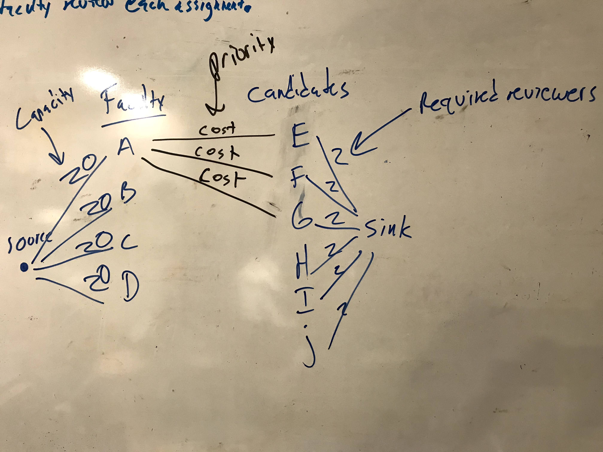

# Reviewer allocation sample code
[J. Nathan Matias](https://natematias.com), January 8, 2021

Do you need to assign reviewers to applicants in some kind of decision-making process? I wrote this code to streamline a few reviewer allocation processes in my own work, and I have published this github repository to have a single place to document that code. 

This software converts the problem of reviewer allocation into a "min-cost flow" optimization problem. It's not novel in any way. If you took an undergrad course in advanced algorithms or optimization, this would be a basic technique, and you might have better ways to solve this problem. 

You can read more here about the general problem and the `ortools` library I used to carry this out. The code uses Python 3.9 and jupyter notebook.

* Explanation for [how to set up the min cost flow algorithm for committee allocation](http://ozark.hendrix.edu/~yorgey/382/static/flow-network-application.pdf).
* ortools library documentation: [Assignment as a Minimum Cost Flow Problem](https://developers.google.com/optimization/flow/assignment_min_cost_flow)

## Illustration of the Min Cost Flow Diagram Used Here

## Example Graph
This software produces a dotfile for illustration (and debugging) in Gephi and GraphVis. Here is an example graph:

# Acknowledgments
Thanks to [David Williamson](http://www.davidpwilliamson.net/work/) for pointing me in the right direction!
